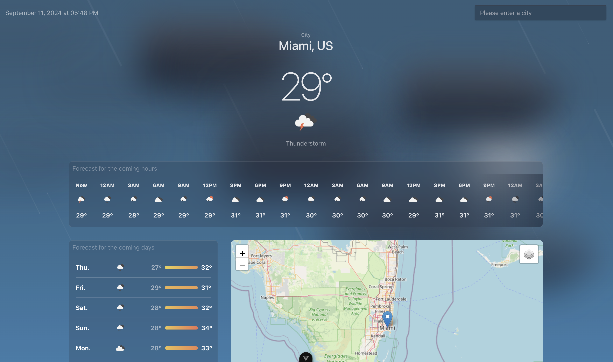
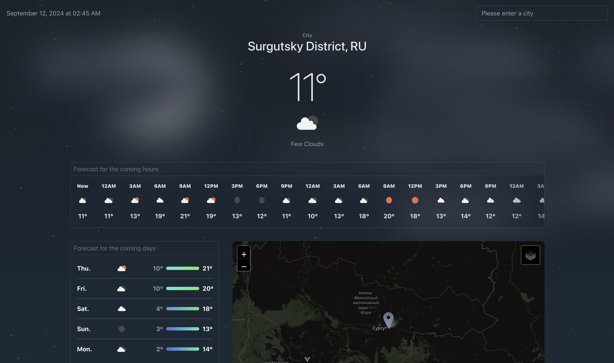

# smappen-weather-app

Weather app using `openweather`, `openstreetmap`, `leaflet` and `pelias.smappen.com` APIs

To configure the project, please add your openweather API KEY in the `.env` or `.env.local` file.

Note : 
> ###### Note :
> I didn’t have access to the paid part of the OpenWeather API, 
> so I couldn’t retrieve the forecast for the coming days. 
> 
> Therefore, the dedicated block in the application uses a calculation to determine the minimum and maximum temperatures 
> for each day via the endpoint: https://api.openweathermap.org/data/2.5/forecast. 
> 
> Calculation method: `useCityStore:forecastDaysWithIconListReducerCb`


## Screenshot of the app (Dynamic wallpaper)

#### Sunny weather


#### Cloudy Weather


#### Rainy Weather (with lighting animation)


#### Clear Night Weather


#### Cloudy Night Weather


#### Rainy Night Weather


# Config

## Recommended IDE Setup

[VSCode](https://code.visualstudio.com/) + [Volar](https://marketplace.visualstudio.com/items?itemName=Vue.volar) (and disable Vetur).

## Type Support for `.vue` Imports in TS

TypeScript cannot handle type information for `.vue` imports by default, so we replace the `tsc` CLI with `vue-tsc` for type checking. In editors, we need [Volar](https://marketplace.visualstudio.com/items?itemName=Vue.volar) to make the TypeScript language service aware of `.vue` types.

## Customize configuration

See [Vite Configuration Reference](https://vitejs.dev/config/).

## Project Setup

```sh
pnpm install
```

### Compile and Hot-Reload for Development

```sh
pnpm dev
```

### Type-Check, Compile and Minify for Production

```sh
pnpm build
```

### Run Unit Tests with [Vitest](https://vitest.dev/)

```sh
pnpm test:unit
```

### Lint with [ESLint](https://eslint.org/)

```sh
pnpm lint
```
